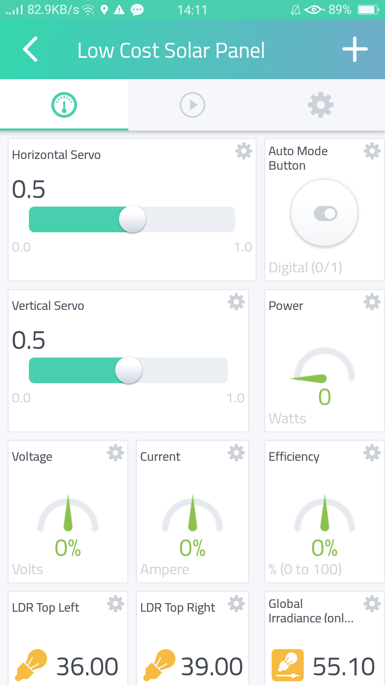

# DIP Project 
    

# Introduction
This is a repo to store codes for *DIP* *Project: Low-Cost Solar Tracker with IoT Capabilities*. Thanks to my team and our supervising professor.

This project is to develop a low-cost solar tracker that requires a smaller number of components and minimum maintenance cost compared to the traditional implementation. 

Besides the development of low-cost solar tracker, the project also aims to integrate the system into the internet, which provides an additional edge to monitor, control, and evaluate the solar tracker’s performance in real-time. It also introduces the freedom of bypassing the automatic sun tracking mechanism to manual mode, which allows the user to orient the *PV panel* to the desired angle. 
 

<div style="text-align: center;">
  
</div>

# Approach
I took responsibility to help build algorithm of controlling movement of solar tracker, meanwhile mostly focused on creating a dashboard to visualize and monitor as well as analyzing of the metrics in real time with our measurements to improve the performance of *PV panel*.

## Tech Stack
- Google Spreadsheet API
- <div style="display: inline-flex">Cayenne IoT Builder </div>
- Automation of data extraction 
- Color detection
- [Optical Character Recognition (OCR)](https://pypi.org/project/pytesseract/): Tesseract OCR

# Reminder
- Basically, we just only need to run the [Code1](.py/Code1.py) to obtain the data such as global irradiance, max global irradiance, temperature and humidity. Then, the data will be sent to [Google Spreadsheet Solar Irradiance Data](https://docs.google.com/spreadsheets/d/1pXHXxocODmDV6p5QbS6dsftAh7GqSlWJ-LKPstyocTs/edit#gid=0) around every 1 minute as long as the program doesn’t execute error and the escape key is not clicked.
- Initially, [Code1](.py/Code2.py) should be used to obtain the measurements from [online source](https://www.ema.gov.sg/solarmap.aspx) by applying colour detection. Meanwhile, I found another webpage, [solar repository](https://www.solar-repository.sg/local-weather) that can provide more accurate information. As such, I decided to obtain the measurements from this website by applying character recognition. It might cause errors when the captured image is blurred and damaged. After setting up well, [Code1](.py/Code1.py) perform in good condition so far.
- All the codes will only be coordinated with *Cayenne IoT*. It has nothing to do with *Arduino IDE* and its board.
[Code1](.py/Code1.py) will be only worked well in **15.6’’** screen sized pc since the adjustment for the cropping of specific details are manually set.
- The implementation of [Code1](.py/Code1.py) still have not completed yet since the connection to *Cayenne* Dashboard is not tested yet to check if the code performs well in terms of the connection.

# How to run?
1. Run the program using *Pycharm* or any *IDE*.
2. Download the `packages` according to the instruction on the top of the codes.
3. Click **Run** and **wait until windows pop out**, then simply observe it.
4. Review the uploaded data on the [Google Spreadsheet Solar Irradiance Data](https://docs.google.com/spreadsheets/d/1pXHXxocODmDV6p5QbS6dsftAh7GqSlWJ-LKPstyocTs/edit#gid=0) but be careful that once you run the program, the data on the spreadsheet will be refreshed. If you want to record down the data, remember to download it as *xlsx* file to your pc. 
5. Only click `ESC` to exit the program.

# Results
## Mobile User Interface (Cayenne)

<div align="center">
  
  
  
  </div>
  <div align="center">
  
  
  
    </div>
  <div align="center">
  
  
  
</div>

## Solar Irradiance Data in Google Sheet 

This repository contains solar irradiance data collected at a specific location. The data includes the time, global solar irradiance, daily maximum global solar irradiance, temperature, humidity, and optimal power.

### Dataset

The dataset is stored in a `data` folder named `solar_irradiance_data-xxx.xlsx`. It consists of the following columns:

- **Time**: The timestamp of the data entry.
- **Global Solar Irradiance (W/m^2)**: The measured global solar irradiance in watts per square meter.
- **Daily Max Global Solar Irradiance (W/m^2)**: The daily maximum global solar irradiance in watts per square meter.
- **Temperature**: The temperature in degrees Celsius.
- **Humidity**: The relative humidity as a percentage.
- **Optimal Power**: The optimal power generated by a solar panel under the given conditions.

### Usage

To use this dataset, you can download the xlsx file, convert it to csv file and load it into your preferred data analysis or machine learning tools. Here's an example of how to load the data using Python and Pandas:

```python
import pandas as pd

# Load the data
data = pd.read_csv('solar_irradiance_data.csv')

# Explore the data
print(data.head())
```

# License
[](./LICENSE)


The solar irradiance data is provided under the [MIT License](LICENSE).